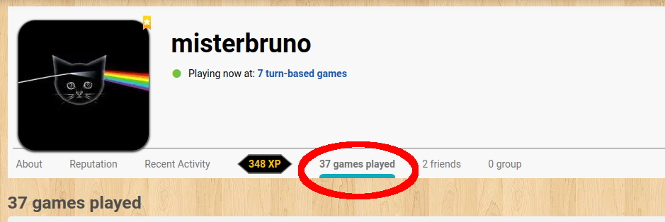
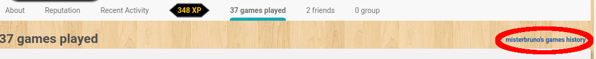
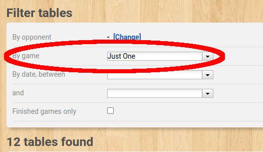
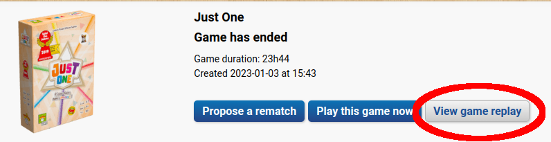
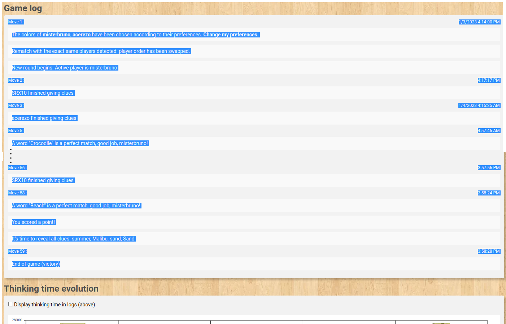

# bga
Scripts related to BoardGameArena (aka BGA)

[BoardGameArena.com](https://boardgamearena.com) is a site where people can play a variety of strategy and board games.  Both real-time and turn-based moves games are available and I believe most games work both ways but some are more suited for either real-time or turn-based:
- Cribbage: A fast-paced two-player card game is probably best played in real-time
- Just One: I think of this as a twist on the _Password_ game show but clues are given by multiple players simultaneously for the active player (_which changes in a round-robin fashion_) to try to guess.  Most of my games have been with 7 players and since there are so many players from all over the world, turn-based is probably the best form.  I have played this with 3-players (including myself) and although I think it was actually turn-based, it might as well have been real-time.

I am just a software developer who plays games at BGA.  I don't work or volunteer for them and I don't develop code for their site.

## Scripts

### `JustOne-parse-log.py`
This is a Python script I created to scrape information from a replay log of a [_Just One_ game](https://boardgamearena.com/gamepanel?game=justone) to produce a nice summary of the tame in tabular form.  It's a little awkward but less awkward than going through a replay or reading the log directly.  It can process logs of an active game as well as a completed game.

#### Processing an active game
Here's what I do to run the script on an active game:
1. Load an active _Just One_ game on BoardGameArena.com
2. Reveal the entire log in the right-hand pane by scrolling to the bottom of the pane and clicking the down arrows.  You usually have to do this a few times until the arrows don't show up anymore:

    
3. Once you have revealed all the log, use your mouse to select the log as text:

    

    You don't have to copy all the text on the page.  It might work but it's easiest just to select the text in the log pane.
4. Copy the text of the log to your clipboard.
5. Paste the text of the log into a file using your favorite text editor, etc, and save it to disk.
6. Use the script on the file!
    ```
    $ ./JustOne-parse-log.py 2022-12-31-JustOne-331712659.rawlog
    Word number  Mystery word  Guess      Clue #0   Clue #1     Clue #2    Clue #3
    1            Bar           Bar        drink     stop        Tender     Gold
    2            Sock          team       Crew      Tube        Puppet     Footie
    3            Vacation      Vacation   trip      Getaway     holiday    Holiday
    4            Candle        Candle     Elton     Wind        fire       wax
    5            Necklace      Necklace   Choker    Anklet      Pendant    Locket
    6            Ladder        Ladder     rung      height      Step       Climb
    7            Carton        Cardboard  milk      Corrugated  container  container
    8            Quarter       number     Precinct  Percentage  Fourth     Twenty-five
    9            Mermaid       Mermaid    fish      Splash      siren      Siren
    10           Hole          Hole       Drill     Golf        black      space
    ```

#### Processing a completed game
Here's what I do to run the script on a completed game:
1. Go to your profile on BoardGameArena.com
2. Select the _X games completed_ tab:
   
3. Optionally:
   1. Select the _X's games history_ link:
      
   2. filter on only _Just One_ games:
      
4. Select the _Just One_ game of interest
5. Press the _View game replay_ button:
   
6. Select all of the text in the _Game log_ section:
   
7. Copy the text to your clipboard
8. Paste the text of the log into a file using your favorite text editor, etc, and save it to disk.
9. Use the script on the file!
   ```
   $ ./JustOne-parse-log.py 2023-01-04-JustOne-332693867.rawlog 
   Word number  Mystery word  Guess      Clue #0    Clue #1      Clue #2    Clue #3   
   1            Crocodile     Crocodile  Nile       Reptile      Alligator  Alligator 
   2            Evening       light      Dracula    Good         morning    sun       
   3            Mushroom      fungus     Phallic    Stuffed      Truffle    Champignon
   4            Fever         Fever      38degrees  sick         shiver     heat      
   5            Fur           Furs       skin       animal       Faux       Pelt      
   6            Rum           None       Grog       Carribean    Pirates    Alcohol   
   7            Stylist       Stylist    clothes    Hairdresser  fashion    Fashion   
   8            Horse         Horse      pony       ride         Arabian    Mustang   
   9            Pilot         flight     Aviator    Astronaut    Plane      Driver    
   10           Beach         Beach      summer     Malibu       sand       Sand      
   ```

### Tips
- When the active user skips a word, the _Guess_ cell should be `None`
- The log does not:
    - relate each clue with the player giving the clue
    - identify which clues were deemed invalid
- The log does show clues being manually eliminated by the judge but I decided to ignore the information
