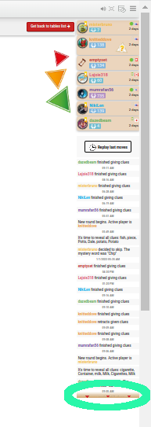
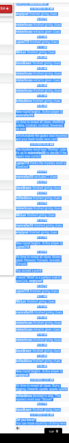

# iyt
Scripts related to BoardGameArena (aka BGA)

[BoardGameArena.com](https://boardgamearena.com) is a site where people can play a variety of strategy and board games.  Both real-time and turn-based moves games are available and I believe most games work both ways but some are more suited for either one or the other:
- Cribbage: A fast-paced two-player card game is probably best played in real-time
- Just One: I think of this as a twist on the _Password_ game show but clues are given by multiple players simultaneously for the active player (_which changes in a round-robin fashion_) to try to guess.  Most of my games have been with 7 players and since there are so many players from all over the world, turn-based is probably the best form.  I have played this with 3-players (including myself) and although I think it was actually turn-based, it might as well have been real-time.

I am just a software developer who plays games at BGA.  I don't work or volunteer for them and I don't develop code for their site.

## Scripts

### `JustOne-parse-log.py`
This is a Python script I created to scrape information from a replay log of a [_Just One_ game](https://boardgamearena.com/gamepanel?game=justone) to produce a nice summary of the tame in tabular form.  It's a little awkward but less awkward than going through a replay or reading the log directly.  Here's what I do to run the script:
1. Load a _Just One_ game
2. Reveal the entire log in the right-hand pane by scrolling to the bottom of the pane and clicking the down arrows.  You usually have to do this a few times until the arrows don't show up anymore:
    
3. Once you have revealed all the log, use your mouse to select the log as text:
    

    You don't have to copy all the text on the page.  It might work but it's easiest just to select the text in the log pane.
4. Copy the text of the log to your clipboard.
5. Paste the text of the log into a file using your favorite text editor, etc, and save it to disk.
6. Use the script on the file!
    ```
    $ ./JustOne-parse-log.py 2022-12-31-JustOne-331712659.rawlog 
    Word number  Mystery word  Guess      Clue #0   Clue #1     Clue #2    Clue #3    
    1            Bar           Bar        drink     stop        Tender     Gold       
    2            Sock          team       Crew      Tube        Puppet     Footie     
    3            Vacation      Vacation   trip      Getaway     holiday    Holiday    
    4            Candle        Candle     Elton     Wind        fire       wax        
    5            Necklace      Necklace   Choker    Anklet      Pendant    Locket     
    6            Ladder        Ladder     rung      height      Step       Climb      
    7            Carton        Cardboard  milk      Corrugated  container  container  
    8            Quarter       number     Precinct  Percentage  Fourth     Twenty-five
    9            Mermaid       Mermaid    fish      Splash      siren      Siren      
    10           Hole          Hole       Drill     Golf        black      space    
    ```

### Tips
- When the active user skips a word, the _Guess_ cell should be `None`